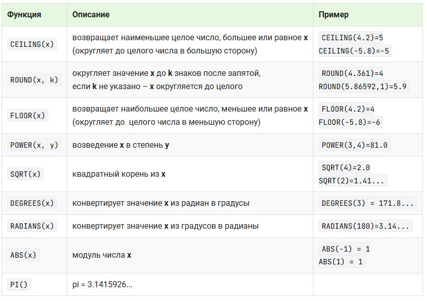
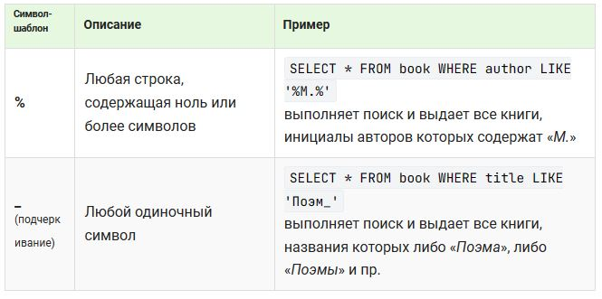

## 1.2 Выборка данных
### Выборка всех данных из таблицы
```
SELECT * FROM <таблица>;
```
### Выборка отдельных столбцов
```
SELECT <поля ч\з ','> FROM <таблица>
```
### Выборка новых столбцов и присвоение им новых имен
```
SELECT <поле> AS <наззвание>, <поле> 
FROM book;

Результат:
+-----------------------+--------+
| Название              | amount |
+-----------------------+--------+ 
| Мастер и Маргарита    | 3      |
| Белая гвардия         | 5      | 
| Идиот                 | 10     |
| Братья Карамазовы     | 2      |
| Стихотворения и поэмы | 15     |
+-----------------------+--------+
```
### Выборка данных с созданием вычисляемого столбца
С помощью SQL запросов можно омуществлять вычисление каждой записи таблицы с помощью вычисляемого столбца. Для него в списке полей после SELECT указывается выражение и задается имя.

Выражение может включать имена столбцов, константы, знаки операций и встроенные функции.

Результатом является таблица со всеми данными выбранных после SELECT столбцов, а также новый столбец, в каждой строке которого вычисляется заданное выражение.

```
SELECT title, author, price, amount, 
	price * amount AS total
FROM book;

Результат:
+-----------------------+------------------+--------+--------+---------+ 
| title                 | author           | price  | amount | total   | 
+-----------------------+------------------+--------+--------+---------+ 
| Мастер и Маргарита    | Булгаков М.А.    | 670.99 | 3      | 2012.97 | 
| Белая гвардия         | Булгаков М.А.    | 540.50 | 5      | 2702.50 | 
| Идиот                 | Достоевский Ф.М. | 460.00 | 10     | 4600.00 | 
| Братья Карамазовы     | Достоевский Ф.М. | 799.01 | 2      | 1598.02 | 
| Стихотворения и поэмы | Есенин С.А.      | 650.00 | 15     | 9750.00 |
+-----------------------+------------------+--------+--------+---------+ 
```
### Выборка данных, вычисляемые столбцы, математические функции
В SQL реализованно множество математических функций для работы с числовыми данными, вот некоторые из них:

```
SELECT title, price,
ROUND((price*18/100/1+18/100),2) AS tax,
ROUND(price/(1+18/100),2) AS price_tax
FROM book;

Результат:
+-----------------------+--------+--------+-----------+
| title                 | price  | tax    | price_tax |
+-----------------------+--------+--------+-----------+
| Мастер и Маргарита    | 670.99 | 102.35 | 568.64    |
| Белая гвардия         | 540.50 | 82.45  | 458.05    |
| Идиот                 | 460.00 | 70.17  | 389.83    |
| Братья Карамазовы     | 799.01 | 121.88 | 677.13    |
| Стихотворения и поэмы | 650.00 | 99.15  | 550.85    |
+-----------------------+--------+--------+-----------+
```
### Выборка данных, вычисляемые столбцы, логические функции
```
IF(логическое_выражение, выражение_1, выражение_2)
```
В фнкции вычисляется значение логического выражения, если оно истина - в поле заносится значение выражения_1, иначе значение выражения_2.

Допускается использование вложенных функций, вместо выражения_1 или выражения_2 может стоять новая IF.

Пример:
```
SELECT title, amount, price, 
    ROUND(IF(amount<4, price*0.5, price*0.7),2) AS sale
FROM book;
```
### Выборка данных по условию
С помощью запросов можно включать в итоговую выборку не все записи исходной таблицы, а только те, которые соответствуют некоторому условию.  
Для этого существует ключевое слово WHERE и логичекское выражение, от которого зависит будет включена строка в итоговую выборку или нет.  

Логическое выражение может включать операторы сравнения (=, <> не равно, <, >, <=, >=) и другие выражения, допустимые в SQL

Пример:
```
SELECT title, author, price * amount AS total
FROM book
WHERE price * amount > 4000;
```
>В логическом выражении после WHERE нельзя использовать названия столбцов, присвоенные им с помощью AS (сначала - вычисление логич. выражения, потом - формируется "шапка запроса") 

### Выборка данных, логические операции
Логическое выражение после слова WHERE кромме операторов и выражений может включать логические операции(И and, ИЛИ or, НЕ not) и круглые скобки, изменяющие приоритет выполнения операций.

**Приоритет оперций:**
1. круглые скобки
2. умножение(*), деление(/)
3. сложение(+), вычитание(-)
4. операторы сравнения(<,>,=,<=,>=)
5. NOT
6. AND
7. OR

Пример:
```
SELECT title, author, price 
FROM book
WHERE (author = 'Булгаков М.А.' OR author = 'Есенин С.А.') AND price > 600;
```
>В данном запросе обязательно нужно поставить скобки, так как без них сначала вычисляется  author = 'Есенин С.А.' and price > 600, а потом уже выражение через or. Без скобок были бы отобраны все книги Булгакова и те книги Есенина, цена которых больше 600.
### Выборка данных, операторы BETWEEN, IN
Логическое выражение после слова WHERE может включать слова BETWEEN и IN. Приоритет у этих операторов такой же как и у операторов сравнения.

**Оператор BETWEEN** позволяет отобрать данные, относящиеся к некоторому интервалу, включая его границы.

Пример:
```
SELECT title, amount 
FROM book
WHERE amount BETWEEN 5 AND 14;
```

**Оператор IN** позволяет выбирать данные, соответствующие значениям из списка.

Пример:
```
SELECT title, price 
FROM book
WHERE author IN ('Булгаков М.А.', 'Достоевский Ф.М.');
```
### Выборка данных с сортировкой
При выборке можно указать столбец или несколько столбцов, по которым необходимо отсортировать отобранные строки. Для этого используются ключевые слова **ORDER BY**, после которых задаются имена столбцов.   
При этом строки сортируются по первому столбцу, если указан второй столбец, то сортируются только те строки, в которых значения первого столбца ожинаковы.  
По умолчанию ORDER BY выполняет сортировку по возрастанию, чтобы указать направление сортировки после имени столбца указывается ключевое слово **ASC** (по возрастанию) или **DESC** (по убыванию).

Столбцы после ORDER BY можно задавать:
- названием столбца
- номером столбца
- именем столбца (указанным после AS)

Пример:
```
SELECT author, title, amount AS Количество
FROM book
WHERE price < 750
ORDER BY author, amount DESC;

Результат:
+------------------+-----------------------+------------+
| author           | title                 | Количество |
+------------------+-----------------------+------------+
| Булгаков М.А.    | Белая гвардия         | 5          |
| Булгаков М.А.    | Мастер и Маргарита    | 3          |
| Достоевский Ф.М. | Идиот                 | 10         |
| Есенин С.А.      | Стихотворения и поэмы | 15         |
+------------------+-----------------------+------------+
```

>**Важно!** Если названия столбцов заключены в кавычки, то при использовании их в сортировке, необходимо записывать их БЕЗ КАВЫЧЕК.
### Выборка данных, оператор LIKE
Оператор **LIKE** позволяет сравнивать строки, но в отличие от операторов сравнения, LIKE проверяет строки не на полное совпадение, а на соответствие некоторому шаблону.
Шаблон может включать обычные символы или символы-шаблоны. Обычные символы должны точно совпадать с символами строки. Символы-шаблоны могут совпадать с произволными символами строки.

>Строчные и прописные буквы в строках эквивалентны

Пример:Вывести название книг, состоящих длиннее  5 букв.
```
SELECT title
FROM book
WHERE title LIKE "_____%";
