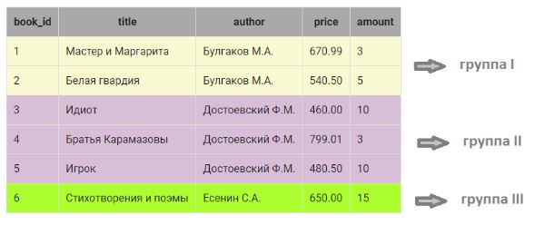
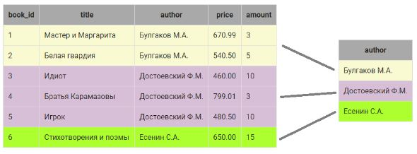
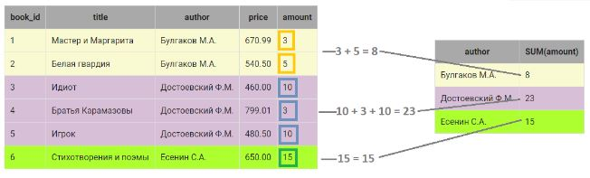
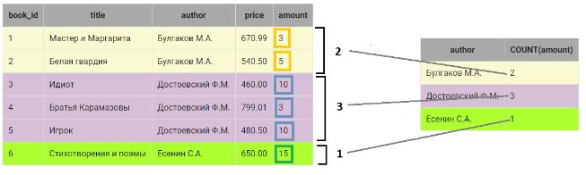

SQL запросы позволяют проводить операции не только для каждой строки, но и для группы элементов, расположенных в одном столбце. Для этого используются групповые (агрегатные) функции.
### Выбор уникальных элементов столбца
Чтобы отобрать уникальные элементы (без повторений) некоторого столбца используется ключевое слово **DISTINCT**, которое размещается сразу после SELECT.

Пример:
```
SELECT DISTINCT author
FROM book;
```
Другой способ - использование оператора **GROUP BY**, который группирует данные при выборке, имеющие одинаковые значения в некотором столбце.

Пример:
```
SELECT author
FROM book
GROUP BY author;
```
### Выборка данных, групповые функции SUM и COUNT
При группировке над элементами, входящими в группу можно выполнять различные действия, например, просуммировать их или найти кол-во элементов в группе.

Пример:
```
SELECT author, SUM(amount), COUNT(amount)
FROM book
GROUP BY author;
```
Что происходит:
1. В таблице book определяются строки, в которых в столбце author одинаковые значения: 
2. Вместо каждой группы в результирующий запрос включается одна запись. Запись как минимум включает значение столбца, по которому осуществляется группировка:
3. Далее можно выполнять операции над элементами КАЖДОЙ группы, например, посчитать общее количество экзэмпляров книг каждого автора с помощью **SUM(столбец)**:
4. Также посчитаем сколько записей относится к группе с помощью функции **COUNT(столбец)**, в скобках можно указать любой столбец группы, если группа не содержит пустых значений:
> - COUNT(*) —  подсчитывает  все записи, относящиеся к группе, в том числе и со значением NULL
> - COUNT(имя_столбца) — возвращает количество записей конкретного столбца (только NOT NULL), относящихся к группе.

**ВАЖНО**  
1. Если столбец указан в SELECT  БЕЗ применения групповой функции, то он обязательно должен быть указан и в GROUP BY. Иначе получим ошибку.
2. Между названием функции и скобкой НЕЛЬЗЯ СТАВИТЬ ПРОБЕЛ. Это особенность платформы.

> можно использовать ключевое слово DISTINCT в агрегатной функции.
>``` 
>SELECT
>    author,
>    COUNT(DISTINCT title)
>FROM book
>GROUP BY author;
>```
### Выборка данных, групповые функции MIN, MAX и AVG
К групповым функциям SQL относятся: MIN(), MAX() и AVG(), которые вычисляют минимальное, максимальное и среднее значение элементов столбца, относящихся к группе.

Пример: вывести минимальную цену книги каждого автора
```
SELECT author, MIN(price) AS min_price
FROM book
GROUP BY author;
```

### Выборка данных c вычислением, групповые функции
В качестве аргумента групповых функций  SQL может использоваться не только столбец, но и любое допустимое в SQL арифметическое выражение.

Пример:
```
SELECT author, ROUND(MAX(price) - AVG(price),2) AS Средняя_цена
FROM book
GROUP BY author;
```
### Вычисления по таблице целиком
Групповые функции позволяют вычислять итоговые значения по всей таблице. Например, можно посчитать общее количество книг на складе, вычислить суммарную стоимость и пр. Для этого после ключевого слова SELECT указывается групповая функция для выражения или имени столбца, а ключевые слова GROUP BY опускаются.

Пример:посчитать общее количество экземпляров книг на складе и их стоимость.
```
SELECT SUM(amount) AS Количество, 
    SUM(price * amount) AS Стоимость
FROM book;
```
### Выборка данных по условию, групповые функции
В запросы с групповыми функциями можно включать условие отбора строк, которое в обычных запросах записывается после WHERE. В запросах с групповыми функциями вместо WHERE используется ключевое слово HAVING , которое размещается после оператора GROUP BY.

Пример: найти минимальную и максимальную цену книг всех авторов, общая стоимость книг которых больше 5000. Результат вывести по убыванию минимальной цены.
```
SELECT author,
    MIN(price) AS Минимальная_цена, 
    MAX(price) AS Максимальная_цена
FROM book
GROUP BY author
HAVING SUM(price * amount) > 5000 
ORDER BY Минимальная_цена DESC;
```
### Выборка данных по условию, групповые функции, WHERE и HAVING
WHERE и HAVING могут использоваться в одном запросе. При этом необходимо учитывать **порядок выполнения  SQL запроса на выборку на СЕРВЕРЕ**:
1. FROM
2. WHERE
3. GROUP BY
4. HAVING
5. SELECT
6. ORDER BY

Сначала определяется таблица, из которой выбираются данные (FROM), затем из этой таблицы отбираются записи в соответствии с условием  WHERE, выбранные данные агрегируются (GROUP BY),  из агрегированных записей выбираются те, которые удовлетворяют условию после HAVING. Потом формируются данные результирующей выборки, как это указано после SELECT ( вычисляются выражения, присваиваются имена и пр. ). Результирующая выборка сортируется, как указано после ORDER BY.

>**Важно!** Порядок ВЫПОЛНЕНИЯ запросов - это не порядок ЗАПИСИ ключевых слов в запросе на выборку. Порядок записи (синтаксис запроса) остается таким же, как рассматривался ранее в курсе. Порядок ВЫПОЛНЕНИЯ  нужен для того, чтобы понять, почему, например, в WHERE нельзя использовать имена выражений из SELECT. Просто SELECT выполняется компилятором позже, чем WHERE, поэтому ему неизвестно, какое там выражение написано.

Пример: Вывести максимальную и минимальную цену книг каждого автора, кроме Есенина, количество экземпляров книг которого больше 10. 
```
SELECT author,
    MIN(price) AS Минимальная_цена,
    MAX(price) AS Максимальная_цена
FROM book
WHERE author <> 'Есенин С.А.'
GROUP BY author
HAVING SUM(amount) > 10;
```
